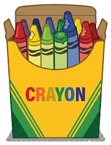

<p align="center">
  
</p>

# 🖍️ Crayon Docs

A Claude Code command that reads your whole codebase and builds **one** local HTML "Crayon Book" that *teaches* you what your code does — built for "vibe coders."

Made by a former infantry Marine. Semper Fi.

## What it does
Generates a single local `CRAYON_BOOK.html`:
- Clickable index, ordered like a book (config → entry → routes → components → utils)
- Per file: language, tech stack, external services (with doc links), function explanations
- **ELI dial** (Explain it Like I'm 5/10/15/20) — slide up as you learn; each level assumes more, explains less. Per-chapter dials plus a whole-book dial in the sidebar
- **Security section per page** — flags exposed keys, missing RLS, unverified webhooks, and other attack surfaces in plain language
- **Local only** — auto-added to `.gitignore`, never published

## See one first
Open [`examples/example-crayon-book.html`](examples/example-crayon-book.html) in your browser — a real Crayon Book generated from [`examples/demo-app`](examples/demo-app), a tiny **intentionally insecure** sticky-notes app (fake keys, planted bugs, answer key included) that doubles as the tool's test fixture. Books built from your own code stay local; this example is published only because the demo code is fake on purpose.

## Install
Copy the `.claude/` folder into your project (keep structure):
```
your-project/
└── .claude/commands/
    ├── crayon.md             # the command
    ├── crayon-reference.md   # ELI rubric + detection + security tables
    └── crayon-template.html  # the book's look & machinery (recommended)
```

## Use
In Claude Code, from your project root:
```
/crayon
```
Runs on your Claude Code subscription — no API key, no per-use billing.

## Customize
- `crayon-reference.md` — tune the ELI levels, service list, or security checks
- `crayon-template.html` — restyle the book (colors, layout, logo); the command only fills the marked regions and leaves your chrome alone. If the template is missing, `/crayon` still works and generates its own page

PRs welcome.

## License
MIT
